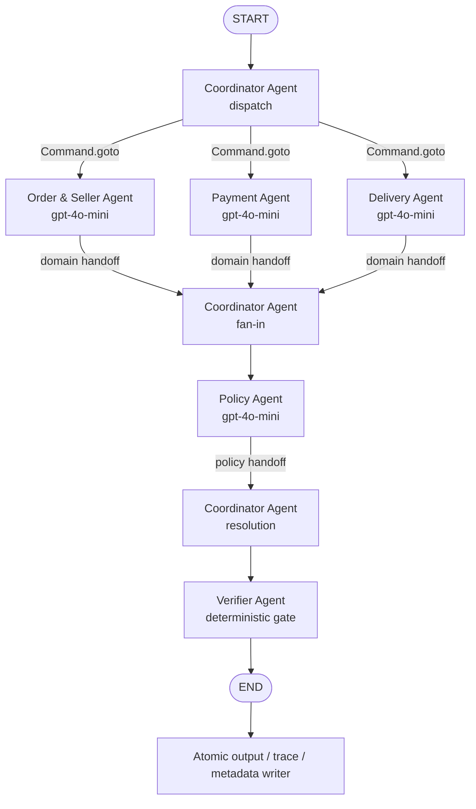

# Kiến trúc LangGraph Multi-Agent

## 1. Mục tiêu thiết kế

Hệ thống xử lý từng case như một graph độc lập, lấy CSV làm nguồn sự thật và dùng
`gpt-4o-mini` để các agent chuyên môn audit rồi handoff kết quả có cấu trúc. Model
không được tự tạo evidence hoặc quyết định số tiền cuối cùng. Policy oracle và
Verifier tính lại các trường nhạy cảm bằng `Decimal`, timestamp và row ID nguồn
trước khi cho phép ghi file.

## 2. Agent graph và luồng handoff



`StateGraph` chỉ có cạnh tĩnh `START -> coordinator_agent` và
`verifier_agent -> END`. Các nhánh còn lại dùng `Command.goto`, nên handoff là
routing thật của graph thay vì chỉ là tên agent trong một prompt. Ba domain node
chạy trong cùng một LangGraph superstep; Coordinator chỉ đi tiếp sau khi reducer
`completed_domains` nhận đủ `order_seller`, `payment` và `delivery`.

## 3. Vai trò và quyền truy cập

| Agent | Quyền đọc | Không được làm | Handoff |
| --- | --- | --- | --- |
| Coordinator | case ID, order ID, domain state | Không đọc bí mật, không tự sửa fact | phân công ba domain; gom kết quả; gửi draft cho Verifier |
| Order & Seller | `orders`, `order_items`, seller ID đã kiểm tra tồn tại | Không đọc payment, không quyết định refund | status, item count, seller bàn giao trễ và model review |
| Payment | giá/freight của item, `order_payments` | Không nhân `payment_value` với installments | totals, discrepancy, reconciliation và model review |
| Delivery | actual/estimated delivery timestamp trong `orders` | Không suy diễn tracking checkpoint | delivered-after-estimate và model review |
| Policy | ba domain handoff, `EC_POLICY_V1` | Không tạo source ID mới | issue/cause/party/refund/action advisory và policy oracle |
| Verifier | source fact snapshot, schema, policy oracle, draft | Không gọi model, không nới cardinality | `write_authorized=true` hoặc exception |

API key chỉ được `python-dotenv` nạp từ `.env` khi khởi động. Key không đi vào
LangGraph state, prompt, trace hay metadata.

## 4. State và contract A2A

`CaseState` chứa các field tách biệt để tránh xung đột update giữa các nhánh:

- `case`, `facts`: input đã join và chuẩn hóa;
- `completed_domains`: list có reducer cộng dồn;
- `order_analysis`, `payment_analysis`, `delivery_analysis`: output độc lập của
  từng domain;
- `policy_decision`, `policy_analysis`: oracle xác định và review của model;
- `draft_output`, `verification`, `final_output`: contract trước/sau gate.

Mỗi model node dùng native Structured Outputs (`json_schema`, `strict=true`) với
một Pydantic schema riêng. Trace ghi `llm_request`, `llm_response`, response ID,
model thực nhận, token usage, thời lượng và output handoff. Không ghi raw key hoặc
toàn bộ môi trường.

## 5. Thứ tự policy bắt buộc

Policy oracle trong `src/policy.py` dùng first-match theo đúng thứ tự:

1. canceled và đã thanh toán;
2. unavailable và đã thanh toán;
3. giao trễ, seller bàn giao sau limit;
4. giao trễ, seller bàn giao đúng hạn;
5. từ hai payment row và tổng tiền khớp trong 0.10 BRL;
6. giao trong estimated date và tổng tiền khớp.

Thứ tự này xử lý đúng overlap như canceled đã có carrier timestamp hoặc split
payment đồng thời giao đúng hạn.

## 6. Ranh giới xác định và kiểm chứng

`src/data_repository.py` parse tiền bằng `Decimal`, không nhân installments và
không đổi múi giờ timestamp CSV. `src/policy.py` dựng composite entity/evidence
ID trực tiếp từ row. Coordinator so từng field của Policy Agent với oracle; nếu
model lệch, trace ghi `deterministic_override_after_model_disagreement`.

Verifier dựng lại toàn bộ expected output và kiểm tra:

- schema/enum/confidence/cardinality;
- entity và evidence tồn tại trong row nguồn;
- first-match policy, root cause, responsible party và action;
- item/freight/payment totals, làm tròn hai chữ số và refund;
- không có evidence trùng hoặc policy evidence sai.

Chỉ sau khi cả 50 graph hoàn tất và đều pass, pipeline mới ghi 50 output, rồi ghi
mới hoàn toàn `logging/trace.jsonl` và `logging/metadata.json` bằng atomic replace.
Run lỗi không thay trace/metadata thành công trước đó.

## 7. Runtime

Entry point online:

```bash
.venv/bin/python -m src.pipeline
.venv/bin/python -m src.validate
```
