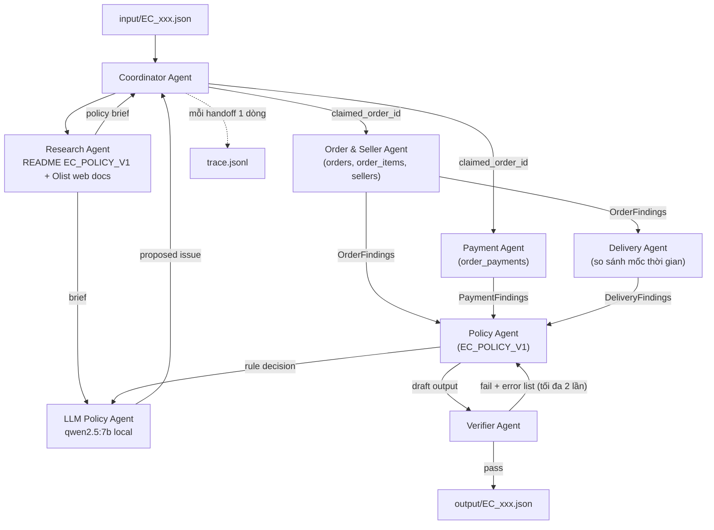

# Architecture — Multi-Agent E-commerce Dispute Resolution (EC_POLICY_V1)

## 1. Sơ đồ tổng thể



## 2. Vai trò và quyền truy cập

| Agent | Quyền đọc dữ liệu | Nhiệm vụ | Output handoff |
|---|---|---|---|
| Coordinator | `input/*.json` | Parse case, phát task, gom kết quả, ghi trace | task message |
| Order & Seller | `olist_orders`, `olist_order_items`, `olist_sellers` | Order status, item rows, `item_total`, `freight_total`, seller vi phạm `shipping_limit_date` | `OrderFindings` |
| Payment | `olist_order_payments` | Payment rows, `payment_total`, đối soát item+freight (±0.10) | `PaymentFindings` |
| Delivery | chỉ timestamps trong `OrderFindings` | Late vs estimated; phân định seller / carrier | `DeliveryFindings` |
| Policy | 3 findings trên | Áp rule theo thứ tự ưu tiên, sinh draft output đủ schema | draft JSON |
| Verifier | draft + index CSV (read-only) | Check schema, evidence, tiền, giới hạn; trả lỗi hoặc ghi file | output cuối / error list |

Nguyên tắc: **mọi con số và phép so sánh đều do tool Python (pandas) tính**; LLM (≤10B params) chỉ điều phối, diễn giải findings và soạn cấu trúc output. LLM không tự cộng tiền, không tự so timestamp.

## 3. Decision tree — kín mọi nhánh

Áp tuần tự, dừng ở nhánh khớp đầu tiên (thứ tự ưu tiên của EC_POLICY_V1):

```text
0.  claimed_order_id không có trong orders.csv
        → hard-stop có kiểm soát: primary_issue = unsupported_late_claim,
          case_status = no_action, mọi entity rỗng, evidence chỉ policy code,
          confidence thấp (0.3). (Không xảy ra trong 50 case chính thức — nhánh phòng thủ.)

1.  order_status == "canceled" AND payment_total > 0
        → canceled_order_paid | platform/OLIST_PLATFORM
        → refund = payment_total | issue_full_refund | ORDER_CANCELED_AFTER_PAYMENT
        LƯU Ý BIÊN: case canceled vẫn có thể CÓ item row (8/50 case) → item_ids,
        seller_ids vẫn liệt kê; và có thể có carrier_date + seller trễ (EC_008)
        nhưng ưu tiên 1 thắng — KHÔNG rơi xuống late_delivery.

2.  order_status == "unavailable" AND payment_total > 0
        → unavailable_order_paid | platform/OLIST_PLATFORM
        → refund = payment_total | issue_full_refund | ORDER_UNAVAILABLE_AFTER_PAYMENT
        LƯU Ý BIÊN: cả 8 case unavailable KHÔNG có item row →
        item_ids = [], seller_ids = [], item_total = freight_total = 0.0,
        payment_total > 0 vẫn tính từ payment rows.

3.  is_late (delivered_customer_date > estimated_delivery_date, so sánh chuỗi
    nguyên văn CSV — format đồng nhất YYYY-MM-DD HH:MM:SS nên so chuỗi an toàn)
    AND tồn tại seller có delivered_carrier_date > shipping_limit_date (item của seller đó)
        → late_delivery_seller | seller/<seller_id vi phạm>
        → refund = freight_total | refund_freight | SELLER_HANDOFF_AFTER_LIMIT
        GUARD: is_late chỉ True khi delivered_customer_date NOT NULL.
        Nếu delivered NULL → is_late = False (không thể kết luận trễ).
        Nếu carrier_date NULL → không seller nào bị coi là trễ.

4.  is_late AND không seller nào vi phạm shipping_limit_date
        → late_delivery_logistics | logistics_provider/LOGISTICS_PROVIDER
        → refund = freight_total | refund_freight | CARRIER_DELIVERED_AFTER_ESTIMATE

5.  n_payment_rows >= 2 AND |payment_total - (item_total + freight_total)| <= 0.10
        → valid_split_payment | không có responsible party
        → refund = 0 | explain_valid_split_payment | MULTIPLE_PAYMENTS_RECONCILED
        (Nhánh này chỉ đạt được khi KHÔNG late — vì late đã bị bắt ở 3/4.)

6.  NOT is_late AND |payment_total - (item_total + freight_total)| <= 0.10
        → unsupported_late_claim | không có responsible party
        → refund = 0 | reject_late_refund | DELIVERY_WITHIN_ESTIMATE

7.  Nhánh vét cạn (không khớp 1–6: ví dụ không late nhưng payment lệch >0.10,
    hoặc canceled/unavailable với payment = 0):
        → unsupported_late_claim, no_action, refund = 0, confidence 0.5.
        (Không xuất hiện trong 50 case — phòng thủ để không bao giờ UNCLASSIFIED.)
```

Xác nhận bằng profiling thật (`scripts/profile_cases.py` chạy trên 50 input):
9 unsupported_late_claim, 9 valid_split_payment, 8 late_delivery_seller,
8 late_delivery_logistics, 8 canceled_order_paid, 8 unavailable_order_paid,
0 UNCLASSIFIED, 0 order-not-found, 0 multi-seller, 0 mixed-lateness.

## 4. Quy tắc dựng output cho từng nhánh

| Trường | Quy tắc |
|---|---|
| `order_ids` | luôn `[claimed_order_id]` |
| `item_ids` | `<order_id>:<order_item_id>` cho từng item row; rỗng nếu không có item; cắt tối đa 5 |
| `seller_ids` | distinct seller từ item rows; rỗng nếu không item; tối đa 5 |
| `payment_ids` | `<order_id>:<payment_sequential>` từng payment row; tối đa 5 |
| `ranked_causes` | rank 1 = root cause của nhánh khớp; tối đa 3 |
| `responsible_parties` | theo bảng rule; nhánh 5/6 để mảng rỗng |
| `evidence_ids` | `order` + `item` + `payment` + `policy`; **`seller:` chỉ khi `late_delivery_seller`**. Case logistics dùng `party_type=logistics_provider` / `LOGISTICS_PROVIDER` và **không** gắn `seller:` (gắn seller ở đây bị grader tính FP). `seller_ids` trong entities vẫn điền khi có item row (theo README). |
| `item_total_brl` / `freight_total_brl` | sum từ item rows, `round(x, 2)`; 0.0 nếu không item |
| `payment_total_brl` | sum payment rows, `round(x, 2)` |
| `recommended_refund_brl` | payment_total (nhánh 1,2) / freight_total (3,4) / 0.0 (5,6,7) |
| `case_status` | `action_required` ⟺ refund > 0, ngược lại `no_action` |
| `confidence` | 0.95 nhánh 1–2 (điều kiện tuyệt đối), 0.9 nhánh 3–5, 0.85 nhánh 6, 0.5 nhánh 7, 0.3 nhánh 0 |
| `resolution_actions` | đúng 1 action theo bảng rule |

## 5. Vòng lặp fix (Verifier loop)

Verifier chạy checklist thuần code, fail ở đâu trả error message cụ thể ở đó:

1. **Schema**: đủ key, đúng kiểu, `confidence ∈ [0,1]`, `case_status ∈ {action_required, no_action}`, `primary_issue` thuộc 6 giá trị hợp lệ, cause_code thuộc 6 code hợp lệ.
2. **Giới hạn số lượng**: ≤5 ID/entity set, ≤10 evidence, ≤3 causes, ≤3 parties, ≤5 actions.
3. **Evidence tồn tại thật**: từng `order:/item:/payment:/seller:` được tra ngược vào CSV index; `policy:` phải trùng cause_code rank 1. Sai format hoặc không tồn tại → fail (tránh false positive).
4. **Đối chiếu tiền độc lập**: Verifier tự tính lại 4 số tiền từ CSV (không tin Policy Agent), lệch >0.005 → fail; kiểm tra làm tròn 2 chữ số.
5. **Nhất quán logic**: refund > 0 ⟺ `action_required`; action khớp primary_issue; responsible party khớp bảng rule; nhánh không item thì item/seller rỗng và item/freight = 0.0.

Luồng fix: fail → error list gửi lại Policy Agent sửa draft (tối đa 2 vòng) → nếu vẫn fail, Coordinator ghi output từ **rule engine fallback** (kết quả deterministic thuần code, luôn hợp lệ theo xây dựng). Bảo đảm: không case nào bị hard gate vì schema/evidence lỗi.

## 6. Trace và metadata

- `trace.jsonl`: mỗi handoff một dòng `{case_id, step, from_agent, to_agent, payload_summary, ts}`; ghi mới toàn bộ mỗi run (không append run cũ).
- `metadata.json`: tên model, parameter size (≤10B), framework, runtime tổng.
- Model name khai báo trong source code; API key chỉ nằm trong `.env` (không commit).
