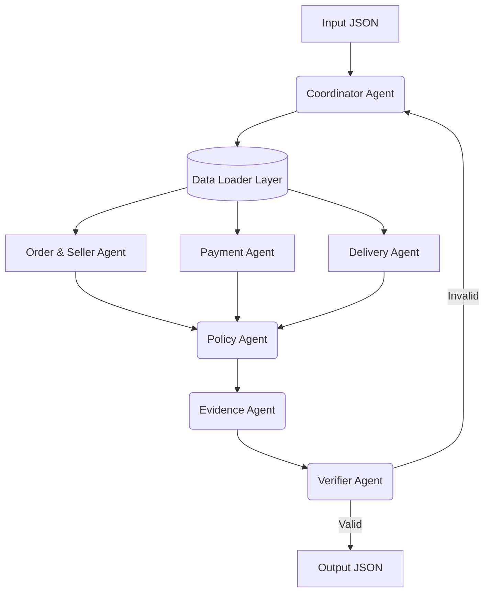

# Multi-Agent Architecture

## 1. System Overview
Hệ thống giải quyết khiếu nại (Dispute Resolution) thương mại điện tử Olist được thiết kế bằng kiến trúc Multi-Agent. Quá trình xử lý không diễn ra trong một prompt duy nhất mà được chia nhỏ cho 7 agent chuyên biệt.

## 2. Agent Roles

1. **Coordinator Agent**: Nhận khiếu nại, trích xuất `claimed_order_id`, gọi các Data Layer và phân phối công việc cho các agent khác, sau đó tổng hợp kết quả.
2. **Order & Seller Agent**: Phân tích tình trạng đơn hàng, danh sách sản phẩm (items), thông tin seller và hạn giao hàng (`shipping_limit_date`).
3. **Payment Agent**: Đối soát tổng tiền thanh toán (`payment_value`) với tổng tiền sản phẩm và phí vận chuyển (`price` + `freight_value`). Xác định các trường hợp thanh toán chia nhỏ (split payment).
4. **Delivery Agent**: Phân tích thời gian giao hàng thực tế (`order_delivered_customer_date`), thời gian dự kiến (`order_estimated_delivery_date`), thời gian giao cho đơn vị vận chuyển (`order_delivered_carrier_date`) để xác định việc giao trễ thuộc lỗi của Seller hay Logistics.
5. **Policy Agent**: Áp dụng EC_POLICY_V1 theo đúng thứ tự ưu tiên để đưa ra nguyên nhân (root cause), bên chịu trách nhiệm (responsible party), khoản hoàn và hành động. Các trường chính thức được quyết định bằng rule có thể kiểm chứng; LLM không được phép thay đổi sự kiện hay số tiền từ CSV.
6. **Evidence Agent**: Chọn tập evidence tối thiểu, có thứ tự ổn định, đủ chứng minh quyết định policy và các tổng tài chính được báo cáo; seller chỉ là evidence khi seller chịu trách nhiệm.
7. **Verifier Agent**: Kiểm tra tính hợp lệ của schema, giới hạn mảng, làm tròn số tiền và tính logic của kết quả trước khi xuất file JSON.

## 3. Handoff Flow

## 4. Quyền truy cập và contract handoff

| Thành phần | Được đọc | Không được tự tạo/sửa | Output handoff |
| --- | --- | --- | --- |
| Coordinator | Input case và context từ Data Loader | Sự kiện đơn hàng, payment, delivery | Context theo `claimed_order_id` |
| Order & Seller | `orders`, `order_items`, seller ID trong item | Payment và kết luận policy | Trạng thái, item, seller, shipping limit |
| Payment | `order_payments`, giá và freight trong item | Trạng thái giao hàng và bên chịu trách nhiệm | Payment rows, tổng tiền, kết quả reconciliation |
| Delivery | Timestamp đơn hàng và shipping limit | Số tiền hoàn | Kết quả late/on-time và seller/logistics cause |
| Policy | Chỉ output đã chuẩn hóa của ba specialist | ID hoặc sự kiện không tồn tại trong handoff | Issue, cause, party, refund, action |
| Evidence | Output specialist và quyết định Policy | Evidence không dựng được từ handoff | Evidence IDs có thứ tự chuẩn |
| Verifier | Candidate output và schema | Quyết định nghiệp vụ mới | Output hợp lệ hoặc lỗi trả về Coordinator |

Chỉ Coordinator/Data Loader đọc trực tiếp CSV. Specialist nhận đúng phần context cần thiết; Policy và Verifier không truy cập lại dữ liệu thô. Chỉ Coordinator ghi `output/*.json`, còn Tracer ghi `logging/trace.jsonl`.

## 5. Tính xác định và bằng chứng

- Item, payment và seller ID được sắp xếp theo thứ tự chuẩn trước khi handoff.
- `confidence = 1.0` chỉ khi case khớp đầy đủ một rule EC_POLICY_V1 từ dữ liệu có thể kiểm chứng.
- Evidence được chọn theo điều kiện của issue; không thêm seller/item không tham gia chứng minh rule.
- Verifier kiểm tra giới hạn entity/evidence/action, số tiền làm tròn và quan hệ giữa refund với `case_status`.

## 6. Models and Runtime
- **Model sử dụng**: `gpt-4o-mini` (OpenAI, ~8B parameters)
- **Runtime**: Python + Pandas + OpenAI API
- Phù hợp giới hạn ≤ 10B tham số của đề tài.
