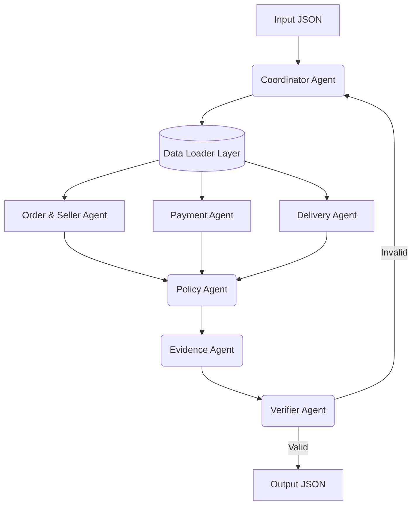

# Multi-Agent Architecture

## 1. System Overview
Hệ thống giải quyết khiếu nại (Dispute Resolution) thương mại điện tử Olist được thiết kế bằng kiến trúc Multi-Agent. Quá trình xử lý không diễn ra trong một prompt duy nhất mà được chia nhỏ cho 7 agent chuyên biệt. Mỗi agent có một lượt gọi `gpt-4o-mini` bằng OpenAI Responses API và Structured Outputs; các lớp Python giữ vai trò orchestration, grounding và validation.

## 2. Agent Roles

1. **Coordinator Agent**: Dùng GPT lập routing plan từ case, kiểm tra lại `case_id`/`claimed_order_id`, gọi Data Layer và điều phối các agent khác.
2. **Order & Seller Agent**: Dùng GPT Structured Outputs để phân tích tình trạng đơn hàng, items, seller và `shipping_limit_date`; lớp grounding chặn item ID ngoài dữ liệu.
3. **Payment Agent**: Dùng GPT để đối soát payment với item + freight. Phép cộng dùng `Decimal` xác định để tránh lỗi số học, còn kết quả diễn giải được model bàn giao theo schema.
4. **Delivery Agent**: Dùng GPT để xác định giao trễ và seller/logistics từ các timestamp cùng comparison facts có thể kiểm chứng.
5. **Policy Agent**: Dùng GPT đánh giá đủ 6 luật EC_POLICY_V1 theo thứ tự và chọn luật khớp đầu tiên. Không còn nhánh quyết định `if/elif` theo từng primary issue.
6. **Evidence Agent**: Dùng GPT chọn evidence từ allowlist có thật; grounding guard loại hallucinated ID và bảo đảm tập bằng chứng đầy đủ.
7. **Verifier Agent**: Dùng GPT audit tính nhất quán ngữ nghĩa; Pydantic và các kiểm tra xác định vẫn là cổng cuối cho schema, giới hạn và số tiền.

## 3. Handoff Flow

## 4. Quyền truy cập và contract handoff

| Thành phần | Được đọc | Không được tự tạo/sửa | Output handoff |
| --- | --- | --- | --- |
| Coordinator | Input case và context từ Data Loader | Sự kiện đơn hàng, payment, delivery | Context theo `claimed_order_id` |
| Order & Seller | `orders`, `order_items`, seller ID trong item | Payment và kết luận policy | Trạng thái, item, seller, shipping limit |
| Payment | `order_payments`, giá và freight trong item | Trạng thái giao hàng và bên chịu trách nhiệm | Payment rows, tổng tiền, kết quả reconciliation |
| Delivery | Timestamp đơn hàng và shipping limit | Số tiền hoàn | Kết quả late/on-time và seller/logistics cause |
| Policy | Chỉ output đã chuẩn hóa của ba specialist | ID hoặc sự kiện không tồn tại trong handoff | Issue, cause, party, refund, action |
| Evidence | Output specialist và quyết định Policy | Evidence không dựng được từ handoff | Evidence IDs có thứ tự chuẩn |
| Verifier | Candidate output và schema | Quyết định nghiệp vụ mới | Output hợp lệ hoặc lỗi trả về Coordinator |

Chỉ Coordinator/Data Loader đọc trực tiếp CSV. Specialist nhận đúng phần context cần thiết; Policy và Verifier không truy cập lại dữ liệu thô. Chỉ Coordinator ghi `output/*.json`, còn Tracer ghi `logging/trace.jsonl`.

## 5. Tính xác định và bằng chứng

- Item, payment và seller ID được sắp xếp theo thứ tự chuẩn trước khi handoff.
- Confidence do Policy Agent tự đánh giá theo độ đầy đủ và nhất quán của bằng chứng; giá trị thô được giữ trong trace và output chỉ áp dụng giới hạn tổng quát `[0, 0.99]`, không ép chắc chắn tuyệt đối `1.0`.
- Evidence được chọn theo điều kiện của issue; không thêm seller/item không tham gia chứng minh rule.
- Verifier kiểm tra giới hạn entity/evidence/action, số tiền làm tròn và quan hệ giữa refund với `case_status`.

## 6. Models and Runtime
- **Model sử dụng**: `gpt-4o-mini` qua OpenAI Responses API.
- **Runtime**: Python + Pandas + Pydantic + OpenAI SDK Structured Outputs.
- **Số lượt gọi**: 7 lượt model/case; trace chính thức hiện có 350 response ID cho 50 case.
- **Lưu ý giới hạn tham số**: OpenAI không công bố chính thức parameter count của `gpt-4o-mini`, nên không thể dùng tài liệu chính thức để chứng minh chắc chắn điều kiện ≤10B.
